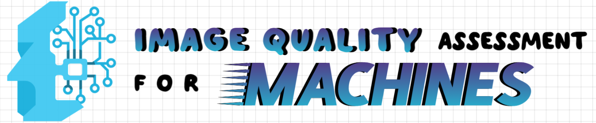

<div align="center">
  
  
  <h3><strong> Image Quality Assessment for Machines: Paradigm, Large-scale Database, and Models
</strong></h3> 

  [](https://github.com/XiaoqiWang/MIQD-2.5M)
  [](https://arxiv.org/abs/2508.19850)
  [](https://huggingface.co/)
  [](link-to-colab)
  [](https://github.com/XiaoqiWang/MIQA)
  
[中文文档](README_CN.md) | [English](README.md) | [Colab](colab-link) | [博客](blog-link)
</div>
<div style="font-size: 13px;">
🎯 Project Overview

- 🤖 Machine-Centric: We bypass human perception to evaluate images from the perspective of the deep learning models that use them.  
- 📈 Task-Driven Metrics: Directly measure how degradations like blur, noise, or compression artifacts impact the performance of downstream vision tasks.  
- 💡 A New Paradigm: MIQA offers a new lens for optimizing image processing pipelines where machines make the final decision.
</div>

---
<!--
## 📋 Table of Contents

- [🎯 Project Overview](#-project-overview)
- [📰 News & Announcements](#-news--announcements)
- [🔬 Research Background](#-research-background)
- [✨ Key Features](#-key-features)
- [🛠️ Installation](#️-installation)
- [📦 Model Weights](#-model-weights)
- [🚀 Quick Start](#-quick-start)
- [📊 Evaluation](#-evaluation)
- [📈 Benchmarks](#-benchmarks)
- [📚 Citation](#-citation)
- [🤝 Contributing](#-contributing)
- [📧 Contact](#-contact)
-->

## 🔥 **Latest Updates**
> To do list:
> 
> **[2025-XX-XX]** 📊 [Dataset release and download instructions](link-to-dataset)
>
> **[2025-XX-XX]** 📖 [Interactive Colab tutorial now available](colab-link)
>
> **[2025-XX-XX]** 🤗 [Models uploaded to HuggingFace Hub](huggingface-link)


## 🔬 Research Background
- **Background**: Machine vision systems excel in controlled environments but suffer severe performance degradation from image distortions in real-world deployment. Traditional image quality assessment prioritizes human perceptual fidelity, creating a fundamental mismatch with machine sensitivities.

- **Key Benefits**: The machine-centric framework enables quality monitoring across acquisition, transmission, and processing stages, ensuring reliable machine vision performance and supporting optimization of automated visual systems in adverse conditions.


## ✨ Does MIQA Work?
<div align="center">
  
  
  
  <p><em>Performance improvement across tasks when filtering low-quality images using MIQA scores</em></p>
</div>

<details>
<summary> 🗝️ Key Results</summary>

Our results provide clear evidence of MIQA's effectiveness across three representative computer vision tasks: classification, detection, and segmentation.
The framework consistently identifies images that degrade model performance. By filtering these detrimental samples, MIQA directly leads to improved outcomes and demonstrates the universal utility of a machine-centric approach. This transforms quality assessment from a passive metric into a proactive tool, safeguarding downstream models against the unpredictable image quality of real-world conditions and ensuring robust performance when it matters most.
</details>

---
## 🛠️ Installation Guide

#### Step 1: Install Dependencies

To get started, you'll need to install two essential libraries: **mmcv** and **mmsegmentation**.
<details>
<summary> Install mmcv and mmsegmentation</summary>

* For the latest version of **mmsegmentation**, follow the installation guide here:
  [MMsegmentation Installation Guide](https://mmsegmentation.readthedocs.io/en/main/get_started.html)

* Alternatively, you can install a specific version of **mmsegmentation** based on your CUDA and PyTorch versions. You can find the version compatibility details here:
  [MMCV Installation Guide](https://mmcv.readthedocs.io/zh-cn/latest/get_started/installation.html)

</details>

#### Step 2: Handle CUDA Version Compatibility

If your CUDA version is relatively high, such as 12.7 or higher, you might encounter a version mismatch with **mmcv**. In this case, you may need to install a compatible version of **mmcv**.
<details>
<summary> Install a compatible version of mmcv</summary>

For example, if you need a specific version of **mmcv**, you can uninstall the existing versions and install a compatible one as follows:


```bash
pip uninstall mmcv mmcv-full -y
mim install "mmcv>=2.0.0rc4,<2.2.0"  # The version specified here is just an example. You should choose a version that is compatible with your CUDA and PyTorch setup.*
```
</details>

#### Step 3: Install Required Libraries

```bash
pip install -r requirements.txt
```
 

 

## 📦 Model Weights

Pre-trained model weights are available for download:

好的，根据您提供的详细性能数据，我们可以将原有的模型下载表格进行重构，使其更具信息量和说服力。

这里的核心是将原来定性的描述（如 "Fast inference", "Best accuracy"）替换为定量的、来自核心任务的性能指标（SRCC/PLCC），这能更直接地证明模型的有效性。

以下是几个不同风格和侧重点的修改方案。

### **方案一：简洁且直接 (最推荐)**

这个版本直接将核心指标整合进下载表格，信息密度高，一目了然。我们假设表格中的 `RA-MIQA` 模型就是您要发布的核心模型。

---

## 📦 Model Weights & Performance
 
| Method          | Image Classification (SRCC/PLCC) | Object Detection (SRCC/PLCC) | Instance Segmentation (SRCC/PLCC) |Download |
|:----------------| :---: | :---: | :---: |:---: |
| ResNet-18       | `0.5131 / 0.5427` | `0.7541 / 0.7734` | `0.7582 / 0.7790` |[**Download**](YOUR_MODEL_LINK) |
| ResNet-50       | `0.5581 / 0.5797` | `0.7743 / 0.7925` | `0.7729 / 0.7933` |[**Download**](YOUR_MODEL_LINK) |
| EfficientNet-b1 | `0.5901 / 0.6130` | `0.7766 / 0.7950` | `0.7808 / 0.7999` |[**Download**](YOUR_MODEL_LINK) |
| EfficientNet-b5 | `0.6330 / 0.6440` | `0.7866 / 0.8041` | `0.7899 / 0.8074` |[**Download**](YOUR_MODEL_LINK) |
| ViT-small       | `0.5998 / 0.6161` | `0.7992 / 0.8142` | `0.7968 / 0.8139` |[**Download**](YOUR_MODEL_LINK) |
| **RA-MIQA**     | **`0.7003 / 0.6989`** | **`0.8125 / 0.8264`** | **`0.8188 / 0.8340`** |[**Download**](YOUR_MODEL_LINK) |

Models will be automatically downloaded on first use:

```python
from machine_iqa import MIQAModel

# Initialize the MIQA model by specifying the desired method
model = MIQAModel('ra-miqa')  # The model will be downloaded automatically
```

## 🚀 Quick Start

### Single Image Assessment

```python
from machine_iqa import MIQAModel
import cv2

# Load model
model = MIQAModel('ra-miqa')

# Load and assess image
image = cv2.imread('path/to/image.jpg')
quality_score = model.assess(image)
print(f"Quality Score: {quality_score:.3f}")
```

<details>
<summary>📸 Demo Results</summary>

| Image | Quality Score | Prediction |
|-------|---------------|------------|
|  | 0.892 | High Quality |
|  | 0.634 | Medium Quality |
|  | 0.298 | Low Quality |

</details>

### Batch Processing

```python
from machine_iqa import batch_assess
import glob

# Process entire directory
image_paths = glob.glob('dataset/*.jpg')
scores = batch_assess(image_paths, model_name='ra-miqa')

for path, score in zip(image_paths, scores):
    print(f"{path}: {score:.3f}")
```

### Video Assessment

```python
from machine_iqa import VideoMIQA

# Initialize video assessor
video_iqa = VideoMIQA('ra-miqa')

# Process video file
results = video_iqa.assess_video('path/to/video.mp4')
print(f"The distribution of quality scores: {results['mean_score']:.3f}")
```

<details>
<summary>🎥 Video Demo Results</summary>

Sample video processing results:
- **Frame-by-frame analysis**: Quality scores for each frame
- **Temporal consistency**: Quality variation over time
- **Key insights**: Identification of quality degradation points

</details>

### Real-time Camera Assessment

```python
from machine_iqa import RealTimeIQA
import cv2

# Initialize real-time assessor
rt_iqa = RealTimeIQA('ra-miqa')  # Use lightweight model for speed

# Start camera
cap = cv2.VideoCapture(0)

while True:
    ret, frame = cap.read()
    if not ret:
        break
    
    # Assess frame quality
    score = rt_iqa.assess_frame(frame)
    
    # Display result
    cv2.putText(frame, f'Quality: {score:.3f}', (10, 30), 
                cv2.FONT_HERSHEY_SIMPLEX, 1, (0, 255, 0), 2)
    cv2.imshow('Real-time IQA', frame)
    
    if cv2.waitKey(1) & 0xFF == ord('q'):
        break

cap.release()
cv2.destroyAllWindows()
```

## 🏃 Training and Evaluation

### Training 

```bash
# Basic training
python train.py --config configs/iqa_base.yaml --data_path /path/to/dataset

# Advanced training with custom parameters
python train.py \
    --config configs/iqa_large.yaml \
    --data_path /path/to/dataset \
    --batch_size 32 \
    --learning_rate 1e-4 \
    --epochs 100 \
    --gpu_ids 0,1
```

### Evaluation on Standard Benchmarks

```bash
# Evaluate on test set
python evaluate.py --model_path checkpoints/best_model.pth --test_data /path/to/test

# Cross-dataset evaluation
python evaluate.py --model_path checkpoints/best_model.pth --datasets miqa_cls
```

## 📈 Benchmarks

<details>
<summary>Tabel 1: Performance Benchmark on Composite Performance</summary>

<table>
<thead>
<tr>
<th rowspan="2" style="text-align: center;">Category</th>
<th rowspan="2" style="text-align: left;">Method</th>
<th colspan="4" style="text-align: center;">Image Classification</th>
<th colspan="4" style="text-align: center;">Object Detection</th>
<th colspan="4" style="text-align: center;">Instance Segmentation</th>
</tr>
<tr>
<th style="text-align: center;">SRCC ↑</th>
<th style="text-align: center;">PLCC ↑</th>
<th style="text-align: center;">KRCC ↑</th>
<th style="text-align: center;">RMSE ↓</th>
<th style="text-align: center;">SRCC ↑</th>
<th style="text-align: center;">PLCC ↑</th>
<th style="text-align: center;">KRCC ↑</th>
<th style="text-align: center;">RMSE ↓</th>
<th style="text-align: center;">SRCC ↑</th>
<th style="text-align: center;">PLCC ↑</th>
<th style="text-align: center;">KRCC ↑</th>
<th style="text-align: center;">RMSE ↓</th>
</tr>
</thead>
<tbody>
<tr>
<td rowspan="7" style="text-align: center; vertical-align: middle;"><strong>HVS-based</strong></td>
<td style="text-align: left;">PSNR</td>
<td style="text-align: center;">0.2388</td>
<td style="text-align: center;">0.2292</td>
<td style="text-align: center;">0.1661</td>
<td style="text-align: center;">0.2928</td>
<td style="text-align: center;">0.3176</td>
<td style="text-align: center;">0.3456</td>
<td style="text-align: center;">0.2148</td>
<td style="text-align: center;">0.2660</td>
<td style="text-align: center;">0.3242</td>
<td style="text-align: center;">0.3530</td>
<td style="text-align: center;">0.2196</td>
<td style="text-align: center;">0.2553</td>
</tr>
<tr>
<td style="text-align: left;">SSIM</td>
<td style="text-align: center;">0.3027</td>
<td style="text-align: center;">0.2956</td>
<td style="text-align: center;">0.2119</td>
<td style="text-align: center;">0.2874</td>
<td style="text-align: center;">0.4390</td>
<td style="text-align: center;">0.4505</td>
<td style="text-align: center;">0.3011</td>
<td style="text-align: center;">0.2531</td>
<td style="text-align: center;">0.4391</td>
<td style="text-align: center;">0.4512</td>
<td style="text-align: center;">0.3011</td>
<td style="text-align: center;">0.2435</td>
</tr>
<tr>
<td style="text-align: left;">VSI</td>
<td style="text-align: center;">0.3592</td>
<td style="text-align: center;">0.3520</td>
<td style="text-align: center;">0.2520</td>
<td style="text-align: center;">0.2816</td>
<td style="text-align: center;">0.4874</td>
<td style="text-align: center;">0.4940</td>
<td style="text-align: center;">0.3355</td>
<td style="text-align: center;">0.2465</td>
<td style="text-align: center;">0.4919</td>
<td style="text-align: center;">0.4985</td>
<td style="text-align: center;">0.3392</td>
<td style="text-align: center;">0.2365</td>
</tr>
<tr>
<td style="text-align: left;">LPIPS</td>
<td style="text-align: center;">0.3214</td>
<td style="text-align: center;">0.3280</td>
<td style="text-align: center;">0.2258</td>
<td style="text-align: center;">0.2842</td>
<td style="text-align: center;">0.5264</td>
<td style="text-align: center;"><strong>0.5376</strong></td>
<td style="text-align: center;"><strong>0.3697</strong></td>
<td style="text-align: center;"><strong>0.2390</strong></td>
<td style="text-align: center;">0.5342</td>
<td style="text-align: center;"><strong>0.5453</strong></td>
<td style="text-align: center;"><strong>0.3754</strong></td>
<td style="text-align: center;"><strong>0.2287</strong></td>
</tr>
<tr>
<td style="text-align: left;">DISTS</td>
<td style="text-align: center;"><strong>0.3878</strong></td>
<td style="text-align: center;"><strong>0.3804</strong></td>
<td style="text-align: center;"><strong>0.2724</strong></td>
<td style="text-align: center;"><strong>0.2782</strong></td>
<td style="text-align: center;"><strong>0.5266</strong></td>
<td style="text-align: center;">0.5352</td>
<td style="text-align: center;">0.3659</td>
<td style="text-align: center;">0.2395</td>
<td style="text-align: center;"><strong>0.5363</strong></td>
<td style="text-align: center;">0.5450</td>
<td style="text-align: center;">0.3738</td>
<td style="text-align: center;">0.2288</td>
</tr>
<tr>
<td style="text-align: left;">HyperIQA</td>
<td style="text-align: center;">0.2496</td>
<td style="text-align: center;">0.2279</td>
<td style="text-align: center;">0.1741</td>
<td style="text-align: center;">0.2929</td>
<td style="text-align: center;">0.4462</td>
<td style="text-align: center;">0.4463</td>
<td style="text-align: center;">0.3031</td>
<td style="text-align: center;">0.2537</td>
<td style="text-align: center;">0.4456</td>
<td style="text-align: center;">0.4518</td>
<td style="text-align: center;">0.3031</td>
<td style="text-align: center;">0.2434</td>
</tr>
<tr>
<td style="text-align: left;">MANIQA</td>
<td style="text-align: center;">0.3403</td>
<td style="text-align: center;">0.3255</td>
<td style="text-align: center;">0.2387</td>
<td style="text-align: center;">0.2844</td>
<td style="text-align: center;">0.4574</td>
<td style="text-align: center;">0.4617</td>
<td style="text-align: center;">0.3124</td>
<td style="text-align: center;">0.2515</td>
<td style="text-align: center;">0.4636</td>
<td style="text-align: center;">0.4680</td>
<td style="text-align: center;">0.3176</td>
<td style="text-align: center;">0.2411</td>
</tr>
<tr>
<td colspan="14" style="border-bottom: 1px solid #ddd;"></td>
</tr>
<tr>
<td rowspan="6" style="text-align: center; vertical-align: middle;"><strong>Machine-based</strong></td>
<td style="text-align: left;">ResNet-18</td>
<td style="text-align: center;">0.5131</td>
<td style="text-align: center;">0.5427</td>
<td style="text-align: center;">0.3715</td>
<td style="text-align: center;">0.2527</td>
<td style="text-align: center;">0.7541</td>
<td style="text-align: center;">0.7734</td>
<td style="text-align: center;">0.5625</td>
<td style="text-align: center;">0.1797</td>
<td style="text-align: center;">0.7582</td>
<td style="text-align: center;">0.7790</td>
<td style="text-align: center;">0.5674</td>
<td style="text-align: center;">0.1711</td>
</tr>
<tr>
<td style="text-align: left;">ResNet-50</td>
<td style="text-align: center;">0.5581</td>
<td style="text-align: center;">0.5797</td>
<td style="text-align: center;">0.4062</td>
<td style="text-align: center;">0.2451</td>
<td style="text-align: center;">0.7743</td>
<td style="text-align: center;">0.7925</td>
<td style="text-align: center;">0.5824</td>
<td style="text-align: center;">0.1729</td>
<td style="text-align: center;">0.7729</td>
<td style="text-align: center;">0.7933</td>
<td style="text-align: center;">0.5826</td>
<td style="text-align: center;">0.1661</td>
</tr>
<tr>
<td style="text-align: left;">EfficientNet-b1</td>
<td style="text-align: center;">0.5901</td>
<td style="text-align: center;">0.6130</td>
<td style="text-align: center;">0.4320</td>
<td style="text-align: center;">0.2377</td>
<td style="text-align: center;">0.7766</td>
<td style="text-align: center;">0.7950</td>
<td style="text-align: center;">0.5859</td>
<td style="text-align: center;">0.1720</td>
<td style="text-align: center;">0.7808</td>
<td style="text-align: center;">0.7999</td>
<td style="text-align: center;">0.5918</td>
<td style="text-align: center;">0.1637</td>
</tr>
<tr>
<td style="text-align: left;">EfficientNet-b5</td>
<td style="text-align: center;">0.6330</td>
<td style="text-align: center;">0.6440</td>
<td style="text-align: center;">0.4680</td>
<td style="text-align: center;">0.2301</td>
<td style="text-align: center;">0.7866</td>
<td style="text-align: center;">0.8041</td>
<td style="text-align: center;">0.5971</td>
<td style="text-align: center;">0.1685</td>
<td style="text-align: center;">0.7899</td>
<td style="text-align: center;">0.8074</td>
<td style="text-align: center;">0.6013</td>
<td style="text-align: center;">0.1610</td>
</tr>
<tr>
<td style="text-align: left;">ViT-small</td>
<td style="text-align: center;">0.5998</td>
<td style="text-align: center;">0.6161</td>
<td style="text-align: center;">0.4407</td>
<td style="text-align: center;">0.2370</td>
<td style="text-align: center;">0.7992</td>
<td style="text-align: center;">0.8142</td>
<td style="text-align: center;">0.6099</td>
<td style="text-align: center;">0.1646</td>
<td style="text-align: center;">0.7968</td>
<td style="text-align: center;">0.8139</td>
<td style="text-align: center;">0.6083</td>
<td style="text-align: center;">0.1585</td>
</tr>
<tr style="background-color: #f0f8ff;">
<td style="text-align: left;"><strong>RA-MIQA</strong></td>
<td style="text-align: center;"><strong>0.7003</strong><br><small style="color: #c00;"></small></td>
<td style="text-align: center;"><strong>0.6989</strong><br><small style="color: #c00;"></small></td>
<td style="text-align: center;"><strong>0.5255</strong><br><small style="color: #c00;"></small></td>
<td style="text-align: center;"><strong>0.2152</strong><br><small style="color: #c00;"></small></td>
<td style="text-align: center;"><strong>0.8125</strong><br><small style="color: #c00;"></small></td>
<td style="text-align: center;"><strong>0.8264</strong><br><small style="color: #c00;"></small></td>
<td style="text-align: center;"><strong>0.6263</strong><br><small style="color: #c00;"></small></td>
<td style="text-align: center;"><strong>0.1596</strong><br><small style="color: #c00;"></small></td>
<td style="text-align: center;"><strong>0.8188</strong><br><small style="color: #c00;"></small></td>
<td style="text-align: center;"><strong>0.8340</strong><br><small style="color: #c00;"></small></td>
<td style="text-align: center;"><strong>0.6333</strong><br><small style="color: #c00;"></small></td>
<td style="text-align: center;"><strong>0.1505</strong><br><small style="color: #c00;"></small></td>
</tr>
</tbody>
</table>

</details>

<details>
<summary>Table 2: Consistency & Accuracy Score Benchmark</summary>
<table>
<thead>
<tr>
<th rowspan="3" style="text-align: center; vertical-align: middle;">Method</th>
<th colspan="6" style="text-align: center;">Image Classification</th>
<th colspan="6" style="text-align: center;">Object Detection</th>
<th colspan="6" style="text-align: center;">Instance Segmentation</th>
</tr>
<tr>
<th colspan="3" style="text-align: center;">Accuracy Score</th>
<th colspan="3" style="text-align: center;">Consistency Score</th>
<th colspan="3" style="text-align: center;">Accuracy Score</th>
<th colspan="3" style="text-align: center;">Consistency Score</th>
<th colspan="3" style="text-align: center;">Accuracy Score</th>
<th colspan="3" style="text-align: center;">Consistency Score</th>
</tr>
<tr>
<th style="text-align: center;">SRCC ↑</th>
<th style="text-align: center;">PLCC ↑</th>
<th style="text-align: center;">RMSE ↓</th>
<th style="text-align: center;">SRCC ↑</th>
<th style="text-align: center;">PLCC ↑</th>
<th style="text-align: center;">RMSE ↓</th>
<th style="text-align: center;">SRCC ↑</th>
<th style="text-align: center;">PLCC ↑</th>
<th style="text-align: center;">RMSE ↓</th>
<th style="text-align: center;">SRCC ↑</th>
<th style="text-align: center;">PLCC ↑</th>
<th style="text-align: center;">RMSE ↓</th>
<th style="text-align: center;">SRCC ↑</th>
<th style="text-align: center;">PLCC ↑</th>
<th style="text-align: center;">RMSE ↓</th>
<th style="text-align: center;">SRCC ↑</th>
<th style="text-align: center;">PLCC ↑</th>
<th style="text-align: center;">RMSE ↓</th>
</tr>
</thead>
<tbody>
<tr><td colspan="19" style="font-weight: bold; text-align: left; padding-top: 8px; padding-bottom: 4px; border-bottom: 1px solid #ddd;"><em>HVS-based Methods</em></td></tr>
<tr>
<td style="text-align: left;">PSNR</td>
<td style="text-align: center;">0.2034</td>
<td style="text-align: center;">0.1620</td>
<td style="text-align: center;">0.3541</td>
<td style="text-align: center;">0.2927</td>
<td style="text-align: center;">0.2812</td>
<td style="text-align: center;">0.2692</td>
<td style="text-align: center;">0.2234</td>
<td style="text-align: center;">0.2449</td>
<td style="text-align: center;">0.2747</td>
<td style="text-align: center;">0.3712</td>
<td style="text-align: center;">0.3933</td>
<td style="text-align: center;">0.2839</td>
<td style="text-align: center;">0.2182</td>
<td style="text-align: center;">0.2398</td>
<td style="text-align: center;">0.2616</td>
<td style="text-align: center;">0.3796</td>
<td style="text-align: center;">0.4061</td>
<td style="text-align: center;">0.2770</td>
</tr>
<tr>
<td style="text-align: left;">SSIM</td>
<td style="text-align: center;">0.2529</td>
<td style="text-align: center;">0.2101</td>
<td style="text-align: center;">0.3509</td>
<td style="text-align: center;">0.3740</td>
<td style="text-align: center;">0.3663</td>
<td style="text-align: center;">0.2610</td>
<td style="text-align: center;">0.3434</td>
<td style="text-align: center;">0.3419</td>
<td style="text-align: center;">0.2662</td>
<td style="text-align: center;">0.5128</td>
<td style="text-align: center;">0.5130</td>
<td style="text-align: center;">0.2651</td>
<td style="text-align: center;">0.3271</td>
<td style="text-align: center;">0.3284</td>
<td style="text-align: center;">0.2545</td>
<td style="text-align: center;">0.5174</td>
<td style="text-align: center;">0.5204</td>
<td style="text-align: center;">0.2589</td>
</tr>
<tr>
<td style="text-align: left;">VSI</td>
<td style="text-align: center;">0.3020</td>
<td style="text-align: center;">0.2515</td>
<td style="text-align: center;">0.3473</td>
<td style="text-align: center;">0.4392</td>
<td style="text-align: center;">0.4336</td>
<td style="text-align: center;">0.2528</td>
<td style="text-align: center;">0.3799</td>
<td style="text-align: center;">0.3685</td>
<td style="text-align: center;">0.2634</td>
<td style="text-align: center;">0.5700</td>
<td style="text-align: center;">0.5571</td>
<td style="text-align: center;">0.2565</td>
<td style="text-align: center;">0.3703</td>
<td style="text-align: center;">0.3645</td>
<td style="text-align: center;">0.2509</td>
<td style="text-align: center;">0.5757</td>
<td style="text-align: center;">0.5749</td>
<td style="text-align: center;">0.2481</td>
</tr>
<tr>
<td style="text-align: left;">LPIPS</td>
<td style="text-align: center;">0.2680</td>
<td style="text-align: center;">0.2355</td>
<td style="text-align: center;">0.3488</td>
<td style="text-align: center;">0.3927</td>
<td style="text-align: center;">0.4032</td>
<td style="text-align: center;">0.2567</td>
<td style="text-align: center;">0.4064</td>
<td style="text-align: center;">0.3987</td>
<td style="text-align: center;">0.2598</td>
<td style="text-align: center;"><strong>0.6196</strong></td>
<td style="text-align: center;"><strong>0.6232</strong></td>
<td style="text-align: center;"><strong>0.2415</strong></td>
<td style="text-align: center;">0.3972</td>
<td style="text-align: center;">0.3941</td>
<td style="text-align: center;">0.2476</td>
<td style="text-align: center;"><strong>0.6300</strong></td>
<td style="text-align: center;"><strong>0.6344</strong></td>
<td style="text-align: center;"><strong>0.2344</strong></td>
</tr>
<tr>
<td style="text-align: left;">DISTS</td>
<td style="text-align: center;"><strong>0.3291</strong></td>
<td style="text-align: center;"><strong>0.2768</strong></td>
<td style="text-align: center;"><strong>0.3448</strong></td>
<td style="text-align: center;"><strong>0.4683</strong></td>
<td style="text-align: center;"><strong>0.4628</strong></td>
<td style="text-align: center;"><strong>0.2487</strong></td>
<td style="text-align: center;"><strong>0.4089</strong></td>
<td style="text-align: center;"><strong>0.3999</strong></td>
<td style="text-align: center;"><strong>0.2597</strong></td>
<td style="text-align: center;">0.6174</td>
<td style="text-align: center;">0.6178</td>
<td style="text-align: center;">0.2429</td>
<td style="text-align: center;"><strong>0.4069</strong></td>
<td style="text-align: center;"><strong>0.4012</strong></td>
<td style="text-align: center;"><strong>0.2468</strong></td>
<td style="text-align: center;">0.6255</td>
<td style="text-align: center;">0.6270</td>
<td style="text-align: center;">0.2362</td>
</tr>
<tr>
<td style="text-align: left;">HyperIQA</td>
<td style="text-align: center;">0.2100</td>
<td style="text-align: center;">0.1649</td>
<td style="text-align: center;">0.3540</td>
<td style="text-align: center;">0.2966</td>
<td style="text-align: center;">0.2777</td>
<td style="text-align: center;">0.2695</td>
<td style="text-align: center;">0.3646</td>
<td style="text-align: center;">0.3545</td>
<td style="text-align: center;">0.2649</td>
<td style="text-align: center;">0.5009</td>
<td style="text-align: center;">0.4943</td>
<td style="text-align: center;">0.2684</td>
<td style="text-align: center;">0.3486</td>
<td style="text-align: center;">0.3442</td>
<td style="text-align: center;">0.2530</td>
<td style="text-align: center;">0.5056</td>
<td style="text-align: center;">0.4995</td>
<td style="text-align: center;">0.2626</td>
</tr>
<tr>
<td style="text-align: left;">MANIQA</td>
<td style="text-align: center;">0.2924</td>
<td style="text-align: center;">0.2435</td>
<td style="text-align: center;">0.3481</td>
<td style="text-align: center;">0.3963</td>
<td style="text-align: center;">0.3870</td>
<td style="text-align: center;">0.2587</td>
<td style="text-align: center;">0.3839</td>
<td style="text-align: center;">0.3823</td>
<td style="text-align: center;">0.2618</td>
<td style="text-align: center;">0.4991</td>
<td style="text-align: center;">0.4975</td>
<td style="text-align: center;">0.2679</td>
<td style="text-align: center;">0.3755</td>
<td style="text-align: center;">0.3749</td>
<td style="text-align: center;">0.2498</td>
<td style="text-align: center;">0.5096</td>
<td style="text-align: center;">0.5098</td>
<td style="text-align: center;">0.2608</td>
</tr>
<tr><td colspan="19" style="font-weight: bold; text-align: left; padding-top: 8px; padding-bottom: 4px; border-bottom: 1px solid #ddd;"><em>Machine-based Methods</em></td></tr>
<tr>
<td style="text-align: left;">ResNet-50</td>
<td style="text-align: center;">0.4734</td>
<td style="text-align: center;">0.4411</td>
<td style="text-align: center;">0.3221</td>
<td style="text-align: center;">0.5989</td>
<td style="text-align: center;">0.6551</td>
<td style="text-align: center;">0.2119</td>
<td style="text-align: center;">0.6955</td>
<td style="text-align: center;">0.6898</td>
<td style="text-align: center;">0.2051</td>
<td style="text-align: center;">0.8252</td>
<td style="text-align: center;">0.8457</td>
<td style="text-align: center;">0.1648</td>
<td style="text-align: center;">0.6863</td>
<td style="text-align: center;">0.6847</td>
<td style="text-align: center;">0.1964</td>
<td style="text-align: center;">0.8320</td>
<td style="text-align: center;">0.8480</td>
<td style="text-align: center;">0.1607</td>
</tr>
<tr>
<td style="text-align: left;">EfficientNet-b5</td>
<td style="text-align: center;">0.5586</td>
<td style="text-align: center;">0.5149</td>
<td style="text-align: center;">0.3076</td>
<td style="text-align: center;">0.6774</td>
<td style="text-align: center;">0.7168</td>
<td style="text-align: center;">0.1956</td>
<td style="text-align: center;">0.7042</td>
<td style="text-align: center;">0.6991</td>
<td style="text-align: center;">0.2026</td>
<td style="text-align: center;">0.8353</td>
<td style="text-align: center;">0.8530</td>
<td style="text-align: center;">0.1612</td>
<td style="text-align: center;">0.6933</td>
<td style="text-align: center;">0.6949</td>
<td style="text-align: center;">0.1938</td>
<td style="text-align: center;">0.8419</td>
<td style="text-align: center;">0.8564</td>
<td style="text-align: center;">0.1565</td>
</tr>
<tr>
<td style="text-align: left;">ViT-small</td>
<td style="text-align: center;">0.5788</td>
<td style="text-align: center;">0.5197</td>
<td style="text-align: center;">0.3066</td>
<td style="text-align: center;">0.6798</td>
<td style="text-align: center;">0.7189</td>
<td style="text-align: center;">0.1950</td>
<td style="text-align: center;">0.7121</td>
<td style="text-align: center;">0.7052</td>
<td style="text-align: center;">0.2008</td>
<td style="text-align: center;">0.8459</td>
<td style="text-align: center;">0.8620</td>
<td style="text-align: center;">0.1566</td>
<td style="text-align: center;">0.7168</td>
<td style="text-align: center;">0.7146</td>
<td style="text-align: center;">0.1885</td>
<td style="text-align: center;">0.8487</td>
<td style="text-align: center;">0.8616</td>
<td style="text-align: center;">0.1539</td>
</tr>
<tr style="background-color: #f0f8ff;">
<td style="text-align: left;"><strong>RA-MIQA</strong></td>
<td style="text-align: center;"><strong>0.6573</strong><br></td>
<td style="text-align: center;"><strong>0.5823</strong><br></td>
<td style="text-align: center;"><strong>0.2917</strong><br></td>
<td style="text-align: center;"><strong>0.7707</strong><br></td>
<td style="text-align: center;"><strong>0.7866</strong><br></td>
<td style="text-align: center;"><strong>0.1732</strong><br></td>
<td style="text-align: center;"><strong>0.7448</strong><br></td>
<td style="text-align: center;"><strong>0.7370</strong><br></td>
<td style="text-align: center;"><strong>0.1915</strong><br></td>
<td style="text-align: center;"><strong>0.8526</strong><br></td>
<td style="text-align: center;"><strong>0.8692</strong><br></td>
<td style="text-align: center;"><strong>0.1527</strong><br></td>
<td style="text-align: center;"><strong>0.7363</strong><br></td>
<td style="text-align: center;"><strong>0.7327</strong><br></td>
<td style="text-align: center;"><strong>0.1834</strong><br></td>
<td style="text-align: center;"><strong>0.8632</strong><br></td>
<td style="text-align: center;"><strong>0.8756</strong><br></td>
<td style="text-align: center;"><strong>0.1464</strong><br></td>
</tr>
</tbody>
</table>
</details> 


## 📚 Citation

If you find this work useful in your research, please consider citing:

```bibtex
@article{wang2025miqa,
  title={Image Quality Assessment for Machines: Paradigm, Large-scale Database, and Models},
  author={Wang, Xiaoqi and Zhang, Yun and Lin, Weisi},
  journal={arXiv preprint arXiv:2508.19850},
  year={2025}
}
```


## 🤝 Contributing
* [ ] TO DO : 

We welcome contributions from the community! If you're interested in improving MIQA, please see our [Contributing Guidelines](CONTRIBUTING.md) for details on how to submit bug reports, feature requests, and pull requests.

</details>

<details>
<summary>Development Setup</summary>
To set up your environment for local development, please follow these steps:

1.  **Clone the repository:**
    ```bash
    git clone https://github.com/XiaoqiWang/MIQA.git
    cd MIQA
    ```

2.  **Install dependencies in editable mode:**
    This command installs the project and the development-specific dependencies (like testing tools).
    ```bash
    pip install -e ".[dev]"
    ```

3.  **Set up pre-commit hooks:**
    This ensures your code contributions adhere to our style guidelines automatically.
    ```bash
    pre-commit install
    ```

### Running Tests

We use `pytest` for testing. You can run the test suite to ensure your changes are working correctly.

1.  **Run all tests:**
    ```bash
    pytest tests/
    ```

2.  **Run tests with coverage report:**
    To check how much of the code is covered by tests, run:
    ```bash
    python -m pytest tests/ --cov=miqa # Replace `miqa` with the actual name of your source package if it's different.
    ```
    
</details> 

## 📧 Contact

- **Project Maintainer**: [Xiaoqi Wang](mailto:wangxq79@mail2.sysu.edu.cn)
- **Issues**: Please use [GitHub Issues](https://github.com/XiaoqiWang/MIQA/issues) for bug reports and feature requests

---
**⭐ Star this repository if you find it helpful!😊**

*Last updated: [09/26/2025]* 